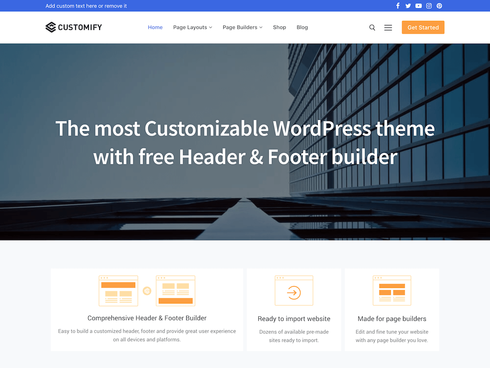

# Customify    
>The Most Customizable WordPress Theme

Customify is fast, lightweight, responsive and super flexible multipurpose theme built with SEO, speed, and usability in mind. 

Unleash the power of your imagination with a true WYSIWYG Header & Footer builder (inside the WordPress Customizer) built exclusively for this theme. 
The theme works great with any of your favorite page builder like Elementor, Beaver Builder, SiteOrigin, Thrive Architect, Divi, Visual Composer, etc.

Combined with the Header & Footer builder, you can build any type of website like shop, business agencies, corporate, portfolio, education, university portal, consulting, church, restaurant, medical and so on.
Customify is compatible with all well-coded plugins, including major ones like WooCommerce, OrbitFox, Yoast, BuddyPress, bbPress, etc.

Learn more about the theme and ready to import demo sites at [https://wpcustomify.com](https://wpcustomify.com/)

Tags: `custom-background` `custom-logo` `custom-menu` `custom-logo` `featured-images` `flexible-header` `footer-widgets` `full-width-template` `sticky-post` `theme-options` `threaded-comments` `translation-ready` `one-column` `two-columns` `three-columns` `left-sidebar` `right-sidebar` `e-commerce` `blog`

## Requirements
PHP: 5.6.2+

WordPress: 4.9.0

## Installation from within WordPress

 1. Visit "Appearance > Themes > Add New" 
 2. Search for "Customify"
 3. Install and activate

## Frequently Asked Questions

**Is Customify Free?**
>Yes! Customify is a free theme, and always will be.

**Does Customify have a pro version?**
> It does! Customify has a premium plugin which extends the available options in the theme. You can learn more about [here]([https://wpcustomify.com/](https://wpcustomify.com/)).

**Where can I find the documentation?**
> Customify has an extensive documentation. You can find it at [https://wpcustomify.com/](https://wpcustomify.com/).

**Do you offer support?**
>Definitely. We offer support for the free theme in the [WordPress.org forums](https://wordpress.org/support/theme/customify).
Premium customers have access to our very own [ticket]([https://wpcustomify.com/contact](https://wpcustomify.com/contact)).
We try to answer all questions - free or premium - within 24 hours.

**Where can I find the theme options?**
>All of our options can be found in the Customizer under 'Appearance > Customize'.

**Does Customify have any widget areas?**
>Customify has up to 6 widget areas which you can add widgets to in Appearance > Widgets.

**How can I make my site look like your screenshot?**
>If you want to replicate the screenshot you see on WordPress.org, please refer to [this article](http://docs.famethemes.com/).

## Change log
We'll keep track of each release in the [CHANGELOG](CHANGELOG.md)

## Copyright & Licensing

Customify WordPress Theme &copy; 2018 WPCustomify.com

Customify is distributed under the terms of the GNU GPL version 3 (see [License](LICENSE.md))

## Acknowledgements
Customify bundles the following third-party resources
### Customify Sites Thumbnail Image, Theme Screenshot images from Pexels
License: [https://www.pexels.com/photo-license/](https://www.pexels.com/photo-license/) ([http://creativecommons.org/publicdomain/zero/1.0](http://creativecommons.org/publicdomain/zero/1.0) - CC0)

assets/images/admin/sites_thumbnail.jpg
[https://www.pexels.com/photo/view-of-high-rise-buildings-during-day-time-302769/](https://www.pexels.com/photo/view-of-high-rise-buildings-during-day-time-302769/)

assets/images/default_cover.jpg
[https://www.pexels.com/photo/architectural-design-architecture-buildings-city-374811/](https://www.pexels.com/photo/architectural-design-architecture-buildings-city-374811/)

Theme Screenshot
- [https://www.pexels.com/photo/woman-wearing-yellow-scoop-neck-shirt-762084/](https://www.pexels.com/photo/woman-wearing-yellow-scoop-neck-shirt-762084/)
- [https://www.pexels.com/photo/man-wearing-white-crew-neck-vans-top-and-blue-denim-button-up-jacket-1040881/](https://www.pexels.com/photo/man-wearing-white-crew-neck-vans-top-and-blue-denim-button-up-jacket-1040881/)
- [https://www.pexels.com/photo/adult-dark-eyewear-facial-expression-428311/](https://www.pexels.com/photo/adult-dark-eyewear-facial-expression-428311/)
- [https://www.pexels.com/photo/man-wearing-white-and-black-legendary-print-t-shirt-157646/](https://www.pexels.com/photo/man-wearing-white-and-black-legendary-print-t-shirt-157646/)
 
 ### Other
 
 - [Font Awesome](http://fontawesome.io) &copy; Dave Gandy, License: http://fontawesome.io/license (Font: SIL OFL 1.1, CSS: MIT License)
 
 - [normalize.css](https://necolas.github.io/normalize.css/) &copy; 2012-2016 Nicolas Gallagher and Jonathan Neal, License: MIT.

 - [Gridlex](https://github.com/devlint/gridlex) &copy; Devlint, License: MIT.

 - [FitVids](https://github.com/davatron5000/FitVids.js) &copy; [Chris Coyier](http://css-tricks.com) & [Dave Rupert](http://daverupert.com/), License: [WTFPL](http://sam.zoy.org/wtfpl/).

 - [WP Color Picker Alpha](https://github.com/kallookoo/wp-color-picker-alpha) &copy; kallookoo, License: GPLv2.
